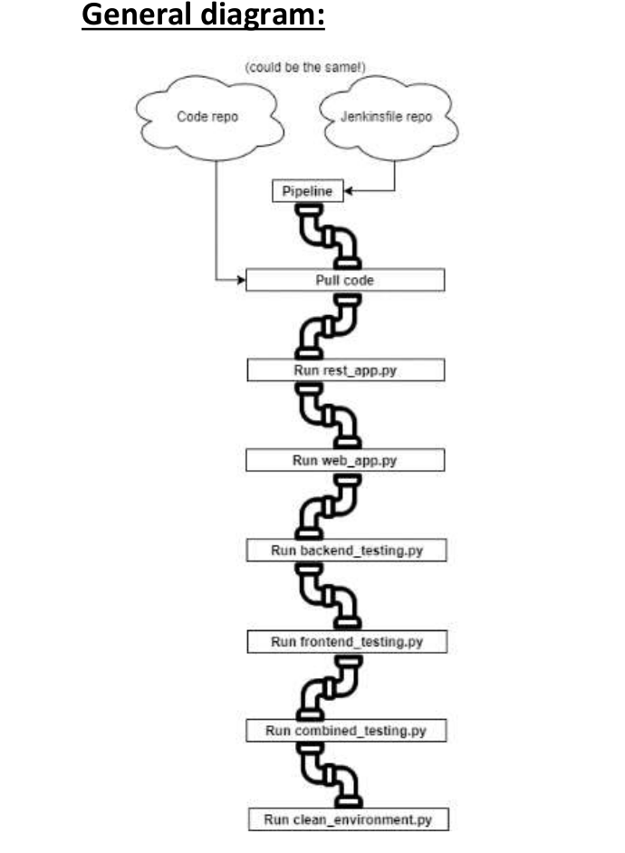

# DevopsExperts
# Final Project - First Part:

**_Libraries Used_**: pymysql, requests, json, flask, Selenium webdriver

REST API (including tests)
DB - MySQL

**_MySQL credentials:_**

**host**= 'sql.freedb.tech'

**port**= 3306

**user**= 'freedb_freedb_nir'

**passwd**= '!Ryr3J%tY6MFF3a'

**db**= 'freedb_freedb_nir'

**_The REST API gateway will be_**: 127.0.0.1:5000/users/<USER_ID>

**_Example to use POST method_**:

**Example**: when posting the below JSON payload to 127.0.0.1:5000/users/1 
A new user will be created in the MySQL DB with the id 1 and the name john.
{“user_name”: “john”}

**_The Web interface is in_**: 127.0.0.1:5001/users/get_user_data/<USER_ID>

**_Example_**:
@app.route("/get_user_name")
def get_user_name(user_id):
user_name = get_user_name_from_db(user_id)
return "<{h1} id='user'>" + user_name + "</H1>"

# **Final Project - Second Part:**

**_Jenkins pipeline configurations_**:

- Jenkins pipeline will use Poll SCM mechanism every 30 minutes to check for a new
  commit to master branch.
- Old builds will be discarded using “Log rotation strategy” for max days of 5 and max
  build of 20.

**_Jenkins pipeline steps_**:

1. Pull code from your Github repository holding your previous project (part 1).
2. Run rest_app.py (backend)
3. Run web_app.py (frontend)
4. Run backend_testing.py
5. Run frontend _testing.py
6. Run combined_testing.py
7. Run clean_environemnt.py

# **Final Project - Third Part:**

